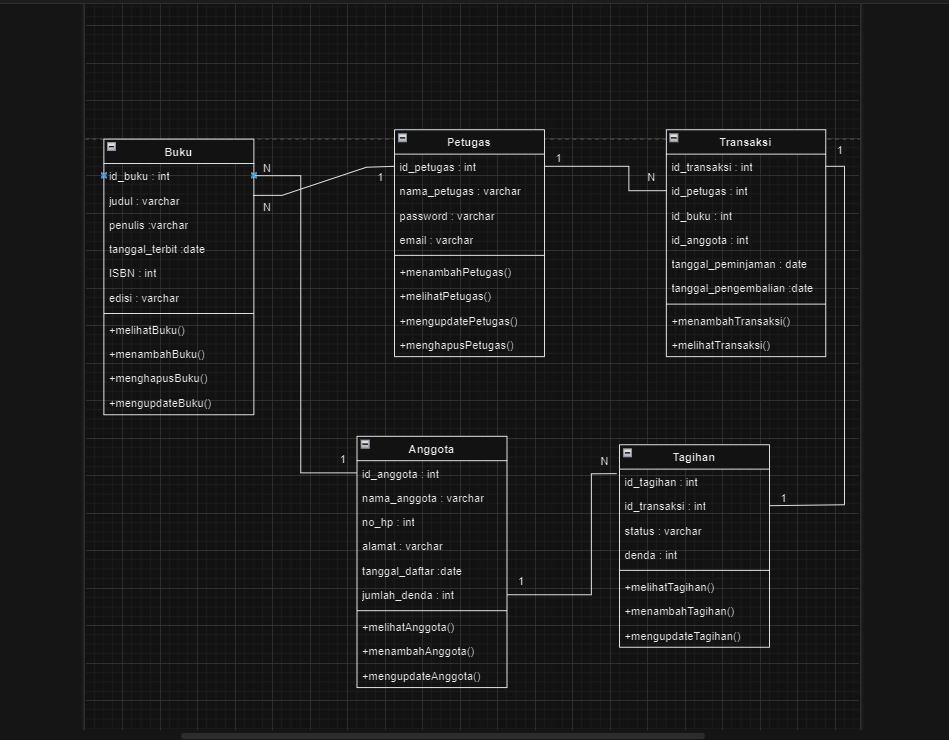
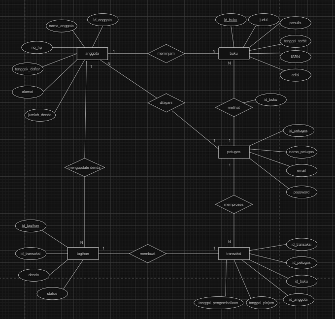

# RESTFULL API PERPUSTAKAAN
<br>

## Deskripsi Projek 

**API Perpustakaan** adalah sebuah API REST FULL API yang dirancang untuk memudahkan pengelolaan data perpustakaan menggunakan Express JS sebagai framework Node.js. API ini memungkinkan pengguna untuk melakukan operasi CRUD (Create, Read, Update, Delete) pada koleksi buku, anggota,petugas,transaksi dan tagihan peminjaman buku.


## Fitur

- **CRUD Buku**: 
  - **Create**: Tambahkan buku baru ke perpustakaan.
  - **Read**: Ambil informasi tentang buku tertentu atau seluruh koleksi buku.
  - **Update**: Perbarui detail buku yang sudah ada.
  - **Delete**: Hapus buku dari perpustakaan.

- **CRUD Anggota**: 
  - **Create**: Daftarkan anggota baru dengan informasi lengkap.
  - **Read**: Ambil detail anggota atau daftar semua anggota.
  - **Update**: Perbarui informasi anggota yang sudah terdaftar.
  - **Delete**: Hapus anggota dari sistem.

- **CRUD Petugas**: 
  - **Create**: Daftarkan petugas baru dengan informasi lengkap.
  - **Read**: Ambil detail petugas atau daftar semua petugas.
  - **Update**: Perbarui informasi petugas yang sudah terdaftar.
  - **Delete**: Hapus petugas dari sistem.

- **CRUD Transaksi**: 
  - **Create**: Daftarkan transaksi baru dengan informasi lengkap.
  - **Read**: Ambil detail transaksi atau daftar semua transaksi.
  - **Update**: Perbarui informasi transaksi yang sudah terdaftar.

- **CRUD Tagihan**: 
  - **Create**: Daftarkan tagihan baru dengan informasi lengkap.
  - **Read**: Ambil detail tagihan atau daftar semua tagihan.
  - **Update**: Perbarui informasi tagihan yang sudah terdaftar.

<br>

## Dependecies / Teknologi yang digunakan

1. **express**

    Express JS sebagai framework Node.js untuk mengelola request dan response HTTP

    ```bash
   npm i express
    ```

2. **mysql**

    package untuk melakukan koneksi ke database

    ```bash
    npm i mysql
    ```

3. **dotenv**

    Dotenv untuk mengatur variabel lingkungan
    ```bash
    npm i dotenv
    ```

4. **body-parser**

    Body-parser untuk mengurai data JSON dari request

    ```bash
    npm i body-parser
    ```
5. **nodemon**

    jalankan dengan mengetikan perintah (nodemon namaFile)

    ```bash
    npm install nodemon
    ```

    Perintah ini akan menjalankan server secara terus menerus

    Aplikasi akan berjalan pada port yang ditentukan di file `.env` .

    <br>

## Cara Penggunaan

1. Pastikan Node.js dan npm telah terinstall di komputer Anda.
2. Clone atau download projek ini ke direktori lokal Anda.
3. Jalankan `npm install` untuk menginstall dependensi yang diperlukan.
4. Buat file `env` dan beri variabel PORT.
5. Jalankan `node index.js` untuk menjalankan aplikasi.
6. Aplikasi akan berjalan di `http://localhost:PORT`, dengan PORT adalah nomor port yang ditentukan dalam file `.env`.

<br>

## Hal Yang Berkaitan

Beberapa Contoh Gambar Yang Berkaitan Terkait Projek REST FULL API Perpustakaan

- **Class Diagram**


- **ERD (Entity Relationship Diagram)**


<br>


## Kontribusi

Jika Anda ingin berkontribusi pada projek ini, silakan lakukan pull request dengan perubahan yang Anda inginkan. Pastikan perubahan Anda sesuai dengan tujuan dan struktur projek ini.

```
    Buat Code Disini
```

<br>

## Kontak

- **Nama:** Syahrzea Imam Wahyudi
- **Email:** [syahrezaimamwahyudi976@gmail.com](mailto:syahrezaimamwahyudi976@gmail.com)
- **Website:** [www.https://github.com/Syahrezaimamw.com](https://github.com/Syahrezaimamw)

<br>


 


